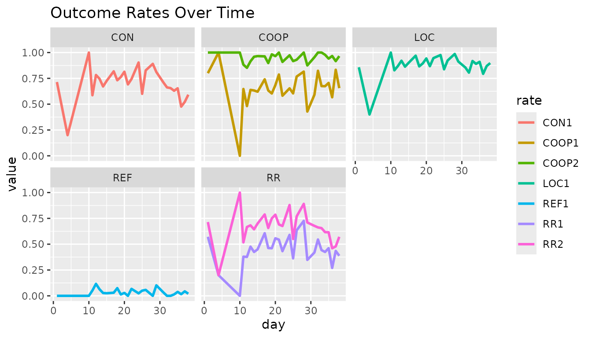

# Intro to outcomerate

This vignette demonstrates the basic applications of the `outcomerate`
package in R. I will draw on the popular `tidyverse` family of packages
for the analysis.

``` r

# load packages
library(outcomerate)
library(dplyr)
library(tidyr)
library(knitr)
```

To keep things lighthearted, I will use a toy dataset named
`middleearth`. The data consists of 1691 rows, each representing an
attempt to interview a member of middle earth. Not all elements in the
sample resulted in a completed interview, however. Some cases could not
be located, others were located but no one was available, some
individuals were found but refused to participate, etc. These particular
‘dispositions’ can be summarized from the `code` variable in the data:

``` r

# load dataset
data(middleearth)

# tabulate frequency table of outcomes
kable(count(middleearth, code, outcome))
```

| code | outcome               |   n |
|:-----|:----------------------|----:|
| NE   | Not eligible          |  71 |
| I    | Complete interview    | 760 |
| P    | Partial interview     | 339 |
| R    | Refusal and break-off |  59 |
| NC   | Non-contact           | 288 |
| UO   | Unlocated             | 173 |
| O    | Other                 |   1 |

It is common for survey practitioners to report a number of outcome
rates. These rates give an indication as to the quality of the field
work. For example, you may want to know the response rate: the
proportion of all cases from our intended sample that actually resulted
in an interview.

How might we go about calculating this?

When we inspect our disposition codes, it becomes apparent that there
could be several ways to do this. For example, you may start by using
the total number of complete cases (760) and dividing this by the number
of observations in the data, 760 / 1691 = 0.45. But what about partially
completed interviews? If you include those, you would get a rate of
(760 + 339) / 1691 = 0.65.

It turns out that there are a lot of ways to calculate such outcome
rates. Unless we specify exactly what we mean by “response rate”, it is
easy for claims regarding survey quality to become opaque, lacking
comparability with other surveys. For this reason, the American
Association for Public Opinion Research (AAPOR) has published a [set of
standardized
definitions](https://aapor.org/wp-content/uploads/2024/03/Standards-Definitions-10th-edition.pdf)
for practitioners. The guide has no fewer than 6 different variants of
the ‘response rate.’ In our example, the rates match AAPOR’s “Response
Rate 1” and “Response Rate 2”:

``` math
\textrm{RR1} = \frac{\textrm{I}}{\textrm{(I + P) + R + O + NC + (UH + UR + UO)}}
= \frac{760}{(760 + 339) + 59 + 1 + 288 + (0 + 0 + 173)}
= 0.47
```

``` math
\textrm{RR2} = \frac{\textrm{(I + P)}}{\textrm{(I + P) + R + O + NC + (UH + UR + UO)}}
= \frac{(760 + 339)}{(760 + 339) + 59 + 1 + 288 + (0 + 0 + 173)}
= 0.68
```

What’s more, the guide has multiple definitions for contact rates,
refusal rates, and cooperation rates, and weighted rates. It can easily
become tedious to look all these up and calculate them by hand. The
`outcomerate` package makes it easier by giving all rates (and more) in
one go:

``` r

disp_counts <- c(I = 760, P = 339, R = 59, NC = 288, O = 1,
                 UH = 40, UR = 60, UO = 73, NE = 71)

e <- eligibility_rate(disp_counts)
outcomerate(disp_counts, e = e)
#>        RR1        RR2        RR3        RR4        RR5        RR6      COOP1 
#> 0.46913580 0.67839506 0.47149080 0.68180052 0.52522460 0.75950242 0.65573770 
#>      COOP2      COOP3      COOP4       REF1       REF2       REF3       CON1 
#> 0.94823123 0.65630397 0.94905009 0.03641975 0.03660258 0.04077402 0.71543210 
#>       CON2       CON3       LOC1       LOC2 
#> 0.71902347 0.80096752 0.89320988 0.89769367
```

The output also includes `LOC1` and `LOC2`, which are package extensions
rather than AAPOR-defined rates.

Each of these rates has a precise definition (see
[`?outcomerate`](https://docs.ropensci.org/outcomerate/reference/outcomerate.md)
for details). As we can see, `RR1` and `RR2` match our earlier
calculations. In the example, I needed to specify the parameter `e`, the
estimated proportion of cases of unknown eligibility (`UH`, `UR`, and
`UO`) that were eligible. The
[`eligibility_rate()`](https://docs.ropensci.org/outcomerate/reference/eligibility_rate.md)
offers a default scalar estimate, but others may be appropriate.

When evidence supports different eligibility probabilities for the
unknown categories, supply a named vector. For example:

``` r

e_by_class <- c(UH = 0.35, UR = 0.70, UO = 0.50)
outcomerate(
  disp_counts,
  e = e_by_class,
  rate = c("RR3", "RR4", "REF2", "CON2")
)
#>        RR3        RR4       REF2       CON2 
#> 0.49366677 0.71386814 0.03832413 0.75284183
```

Each value is the conditional probability that a case in that category
is eligible. For `UH`, this must be the full probability of survey
eligibility, not merely the probability that the unit is an occupied
household. A category may be omitted only when its aggregate count is
zero (after weighting, when weights are supplied). Calculate `e`
separately for each sampling frame. The basis for every estimate should
be documented and should not be selected to inflate a response rate.

If we had wanted just to return the two rates from above, we could
specify this:

``` r

outcomerate(disp_counts, rate = c("RR1", "RR2"))
#>       RR1       RR2 
#> 0.4691358 0.6783951
```

## More Advanced Uses

In certain situations, you may want to calculate outcome rates based on
a vector of codes, rather than a table of frequency counts. It is just
as easy to obtain rates this way using `outcomerate`:

``` r

# print the head of the dataset
head(middleearth)
#> # A tibble: 6 × 9
#>   code  outcome            researcher region    Q1       Q2   day race   svywt
#>   <ord> <ord>              <chr>      <fct>     <fct> <int> <int> <fct>  <dbl>
#> 1 UO    Unlocated          #23        Beleriand NA       NA     1 Elf       32
#> 2 I     Complete interview #23        Beleriand No        7     1 Hobbit    52
#> 3 I     Complete interview #23        Beleriand No        7     1 Hobbit    52
#> 4 P     Partial interview  #13        Beleriand No        7     1 Hobbit    52
#> 5 NE    Not eligible       #50        Beleriand NA       NA     1 Man       85
#> 6 I     Complete interview #23        Beleriand No        7     1 Man       85

# calculate rates using codes; should be same result as before
outcomerate(middleearth$code, e = e)
#>        RR1        RR2        RR3        RR4        RR5        RR6      COOP1 
#> 0.46913580 0.67839506 0.47149080 0.68180052 0.52522460 0.75950242 0.65573770 
#>      COOP2      COOP3      COOP4       REF1       REF2       REF3       CON1 
#> 0.94823123 0.65630397 0.94905009 0.03641975 0.03660258 0.04077402 0.71543210 
#>       CON2       CON3       LOC1       LOC2 
#> 0.71902347 0.80096752 0.89320988 0.89769367
```

Why might we prefer this input format, when it is just as easy to
specify the counts?

Well, if we want to calculate outcome rates by some other covariate, we
typically need to go back to the original data. For example, here we use
`dplyr` and `tidyr` to calculate outcome rates of interest by race:

``` r

# create a small wrapper function
get_rates <- function(x, ...){
  rlist <- c("RR1", "RR2", "COOP1", "COOP2", "CON1", "REF1", "LOC1")
  as.data.frame(as.list(outcomerate(x, rate = rlist, e = e, ...)))
}

# calculate rates by group
middleearth %>%
  group_by(race) %>%
  summarise(n     = n(),
            Nhat  = sum(svywt),
            rates = list(get_rates(code))) %>%
  unnest(cols = c(rates)) %>%
  kable(digits = 2, caption = "Outcome Rates by Race")
```

| race   |   n |  Nhat |  RR1 |  RR2 | COOP1 | COOP2 | CON1 | REF1 | LOC1 |
|:-------|----:|------:|-----:|-----:|------:|------:|-----:|-----:|-----:|
| Dwarf  | 376 |  5640 | 0.29 | 0.35 |  0.78 |  0.95 | 0.37 | 0.02 | 0.92 |
| Elf    | 251 |  8032 | 0.08 | 0.33 |  0.21 |  0.87 | 0.38 | 0.05 | 0.41 |
| Hobbit | 404 | 21008 | 0.41 | 0.86 |  0.45 |  0.94 | 0.91 | 0.05 | 1.00 |
| Man    | 659 | 56015 | 0.76 | 0.89 |  0.82 |  0.97 | 0.92 | 0.03 | 1.00 |
| Wizard |   1 |     3 | 1.00 | 1.00 |  1.00 |  1.00 | 1.00 | 0.00 | 1.00 |

Outcome Rates by Race {.table}

### Weighted Outcome Rates

In certain situations, we also wish to produce *weighted* outcome rates,
using the survey weights that are provided in the data. This is easy to
do with one additional parameter:

``` r

# calculate weighted rates by group
middleearth %>%
  group_by(region) %>%
  summarise(n     = n(),
            Nhat  = sum(svywt),
            rates = list(get_rates(code, weight = svywt))) %>%
  unnest(cols = c(rates)) %>%
  kable(digits = 2, caption = "Weighted Outcome Rates by Region")
```

| region    |   n |  Nhat | RR1w | RR2w | COOP1w | COOP2w | CON1w | REF1w | LOC1w |
|:----------|----:|------:|-----:|-----:|-------:|-------:|------:|------:|------:|
| Beleriand | 415 | 21579 | 0.51 | 0.75 |   0.62 |   0.91 |  0.83 |  0.07 |  0.93 |
| Rhun      | 195 |  9637 | 0.55 | 0.72 |   0.74 |   0.96 |  0.75 |  0.03 |  0.92 |
| Eriador   | 564 | 29794 | 0.64 | 0.83 |   0.75 |   0.98 |  0.85 |  0.02 |  0.94 |
| Rhovanion | 306 | 17830 | 0.61 | 0.85 |   0.69 |   0.96 |  0.89 |  0.03 |  0.96 |
| Harad     | 211 | 11858 | 0.60 | 0.79 |   0.74 |   0.96 |  0.82 |  0.03 |  0.95 |

Weighted Outcome Rates by Region {.table}

Compare this to the equivalent unweighted estimates, and you see that
the results are not the same.

| region    |   n |  Nhat |  RR1 |  RR2 | COOP1 | COOP2 | CON1 | REF1 | LOC1 |
|:----------|----:|------:|-----:|-----:|------:|------:|-----:|-----:|-----:|
| Beleriand | 415 | 21579 | 0.39 | 0.62 |  0.56 |  0.89 | 0.70 | 0.07 | 0.87 |
| Rhun      | 195 |  9637 | 0.41 | 0.55 |  0.71 |  0.96 | 0.57 | 0.02 | 0.87 |
| Eriador   | 564 | 29794 | 0.51 | 0.70 |  0.71 |  0.97 | 0.72 | 0.02 | 0.89 |
| Rhovanion | 306 | 17830 | 0.53 | 0.78 |  0.65 |  0.96 | 0.81 | 0.03 | 0.93 |
| Harad     | 211 | 11858 | 0.50 | 0.70 |  0.68 |  0.95 | 0.73 | 0.03 | 0.90 |

Unweighted Outcome Rates by Region {.table}

### By Date

Lastly, another useful application of grouped analysis is to calculate
the rates by date. This allows you to monitor the quality day by day and
notice if performance starts to change over time.

``` r

library(ggplot2)
library(stringr)

# day-by-day quality monitoring
middleearth %>%
  group_by(day) %>%
  summarise(rates = list(get_rates(code))) %>%
  unnest(cols = c(rates)) %>%
  gather(rate, value, -day) %>%
  mutate(type = str_sub(rate, start = -9, end = -2)) %>%
  ggplot(aes(x = day, y = value, colour = rate)) +
  geom_line(size = 1) +
  facet_wrap(~type) +
  labs(title = "Outcome Rates Over Time")
#> Warning: Using `size` aesthetic for lines was deprecated in ggplot2 3.4.0.
#> ℹ Please use `linewidth` instead.
#> This warning is displayed once per session.
#> Call `lifecycle::last_lifecycle_warnings()` to see where this warning was
#> generated.
```



In this example, we can see that the contact rate (`CON`) and response
rate (`RR`) start to degrade in quality towards day 30. If fieldwork was
still continuing, this could be something to look into and attempt to
explain and/or redress.

## Variance Estimation

To estimate the errors from estimates generated by
[`outcomerate()`](https://docs.ropensci.org/outcomerate/reference/outcomerate.md),
the simplest approach is to use the normal approximation. Since outcome
rates are nothing more than proportions (or nearly so), their standard
error is given by $`SE(p) = \sqrt{(p(1-p))/n}`$.

``` r

# first, calculate the outcome rates
(res <- outcomerate(middleearth$code))
#>        RR1        RR2        RR5        RR6      COOP1      COOP2      COOP3 
#> 0.46913580 0.67839506 0.52522460 0.75950242 0.65573770 0.94823123 0.65630397 
#>      COOP4       REF1       REF3       CON1       CON3       LOC1 
#> 0.94905009 0.03641975 0.04077402 0.71543210 0.80096752 0.89320988

# estimate standard errors using the Normal approximation for proportions 
se <- vapply(
  res,
  function(p) sqrt((p * (1 - p)) / nrow(middleearth)),
  numeric(1)
)
```

With the standard error in hand, we can then construct frequentist
confidence intervals:

``` r

# calculate 95% confidence intervals
rbind(res - (se * 1.96), res + (se * 1.96))
#>            RR1       RR2       RR5       RR6     COOP1     COOP2     COOP3
#> [1,] 0.4453496 0.6561319 0.5014233 0.7391318 0.6330916 0.9376710 0.6336667
#> [2,] 0.4929220 0.7006582 0.5490259 0.7798730 0.6783838 0.9587915 0.6789412
#>          COOP4       REF1       REF3      CON1      CON3      LOC1
#> [1,] 0.9385691 0.02749088 0.03134782 0.6939260 0.7819369 0.8784892
#> [2,] 0.9595310 0.04534863 0.05020021 0.7369382 0.8199982 0.9079305
```

Weighted variance estimation in complex surveys require different
procedures that go beyond the scope of this vignette. We recommend using
`svycontrast()` from the `survey` package to obtain design-based errors
that account for elements such as clustering and stratification.
Bootstrapping primary sampling units (PSUs) may also be an appropriate
method depending on the design at hand.
